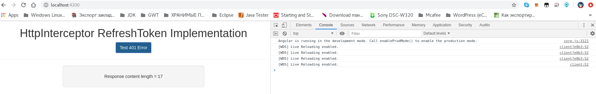

# Angular: авторизация, рефрешим токен и HttpInterceptor

An implementation of Angular 6+ HttpInterceptor using refresh token of oAuth

* Смотри [блог пост](http://qaru.site/questions/16923057/trying-to-repeat-a-http-request-after-refresh-token-with-a-interceptor-in-angular-7)
* See [blog post](https://www.intertech.com/Blog/angular-4-tutorial-handling-refresh-token-with-new-httpinterceptor/)
* Repo [github](https://github.com/IntertechInc/http-interceptor-refresh-token)
  * GET [getDataError401](http://private-4002d-testerrorresponses.apiary-mock.com/getDataError401)
  * GET [getLookupError401](http://private-4002d-testerrorresponses.apiary-mock.com/getLookupError401)




* [Ionic 4 and Angular 7 Tutorial: HTTP Interceptor Example](https://www.djamware.com/post/5c42ca7580aca754f7a9d1e8/ionic-4-and-angular-7-tutorial-http-interceptor-example)
* [This source code is part of Ionic 4 and Angular 7 Tutorial: HTTP Interceptor Example](https://github.com/didinj/ionic4-angular7-httpinterceptor-example)
* https://itnext.io/angular-tutorial-implement-refresh-token-with-httpinterceptor-bfa27b966f57
* https://www.schoolofnet.com/forum/topico/erro-full-authentication-is-required-to-access-this-resource-8268

# INTRODUCTION TO ERROR HANDLING IN ANGULAR 7

* https://habr.com/ru/post/351036/
* [PART 1 - ANGULAR ERRORHANDLER](https://pusher.com/tutorials/error-handling-angular-part-1)
* [PART 2 - HTTP ERROR HANDLING](https://pusher.com/tutorials/error-handling-angular-part-2)

* https://itnext.io/handle-http-responses-with-httpinterceptor-and-toastr-in-angular-3e056759cb16
* [Angular 6 & 7 HTTP Client Interceptor with Error handling](https://scotch.io/@vigneshsithirai/angular-6-7-http-client-interceptor-with-error-handling)
    * [code](https://github.com/vigneshsithirai/Angular-Interceptor)

* https://issue.life/questions/51786002
* [Angular — How to intercept 401 err response and redirect to login page](https://medium.com/@lironhazan/angular-6-401-authentication-error-handling-888922def566)

* http://qaru.site/questions/90529/handling-401s-globally-with-angular
    ```text
    Если вам нужно перехватить какую-либо ошибку, применить к ней обработку и направить ее вниз по цепочке (а не просто добавить побочный эффект с помощью .do), вы можете использовать HttpClient и его перехватчики для выполнения чего-то подобного...
    Поскольку API-интерфейсы внешнего интерфейса истекают быстрее, чем молоко, в Angular 6+ и RxJS 5. 5+ вам необходимо использовать pipe...
    ```
* https://www.tektutorialshub.com/angular/angular-http-error-handling/

# Как добавить запрос CORS

* [Как добавить запрос CORS в заголовке в Angular 5](http://qaru.site/questions/1020733/how-to-add-cors-request-in-header-in-angular-5)
  * https://github.com/angular/angular-cli/blob/master/docs/documentation/stories/proxy.md
  * https://medium.com/@gigioSouza/resolvendo-o-problema-do-cors-com-angular-2-e-o-angular-cli-7f7cb7aab3c2
  * https://developer.mozilla.org/ru/docs/Web/HTTP/CORS/Errors/CORSMissingAllowOrigin
