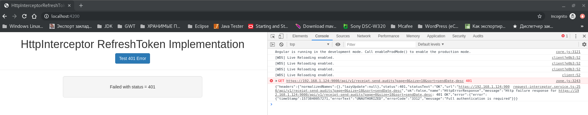

# http-interceptor-refresh-token
An implementation of Angular 4.3+ HttpInterceptor using refresh token of oAuth

See [blog post](https://www.intertech.com/Blog/angular-4-tutorial-handling-refresh-token-with-new-httpinterceptor/) for the explanation of this code.

